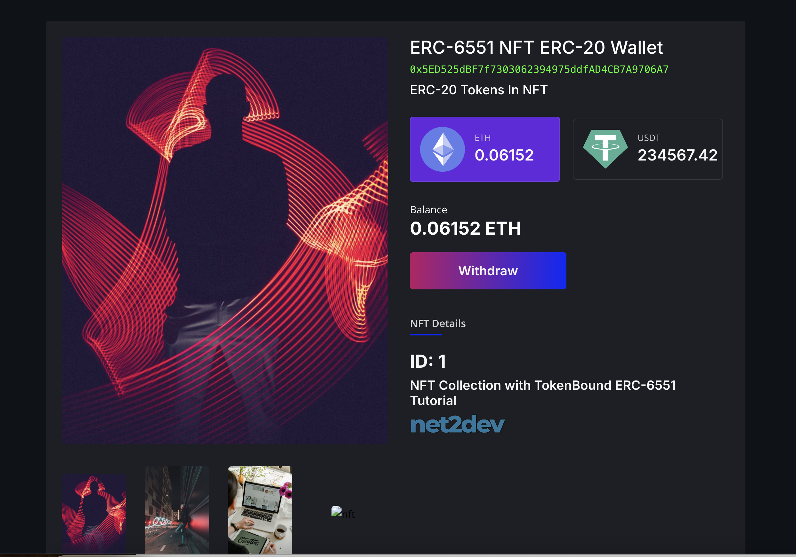

# ERC-6551-NFT-Wallet-Web3-Front-End-NextJS
A NextJS Web3 app that allows users to create and interact ERC-6551 tokenbound accounts (NFT Wallet). Send and Store ERC-20 tokens in NFT. Withdraw tokens and more!



# How to install and test the front-end app.

<h3>Step 1</h3>

Download the folder "ERC-6551-Frontend", then via terminal or shell navigate to the folder and install dependencies, make sure to enable legacy peer dependencies:

```shell
cd ERC-6551-Frontend
npm i --legacy-peer-deps
```

<h3>Step 2 (OPTIONAL) </h3>

If you don't have existing contracts deployed, you may deploy the contract files located inside the repo folder "Contracts". Make sure to update your NFT Collection metadata BaseURI to point to the IPFS CID. Follow the tutorial video for more info. If you deployed a new NFT Collection contract to test, Make sure you mint some NFT's to validate the ERC-6551 Wallet creation.

```shell
N2D-Sample-NFT-Collection.sol
N2D-ERC6551-Account.sol
N2D-ERC6551-Registry.sol
N2D-Sample-Fake-USDT.sol
```

<h3>Step 3</h3>

Open the project folder on your favorite editor and update the "components/config.js" file with all your deployed smart contract addresses:

```shell
const nftContractAddr = 'NFT_COLLECTION_CONTRACT_ADDRESS';
const erc6551RegistryAddr = 'ERC_6551_REGISTRY_CONTRACT_ADDRESS';
const erc6551BaseAccount = 'ERC_6551_ACCOUNT_CONTRACT_ADDRESS';
const usdtContractAddr = 'FAKE_USDT_TOKEN_CONTRACT_ADDRESS';
```

"CTRL + S"  to save!


<h3>Step 4</h3>

Read the "readme-first" located inside the "ERC-6551-Frontend" folder then run the application and test! Follow the tutorial vid for more info.

```shell
cd ERC-6551-Frontend
npm run dev
```
